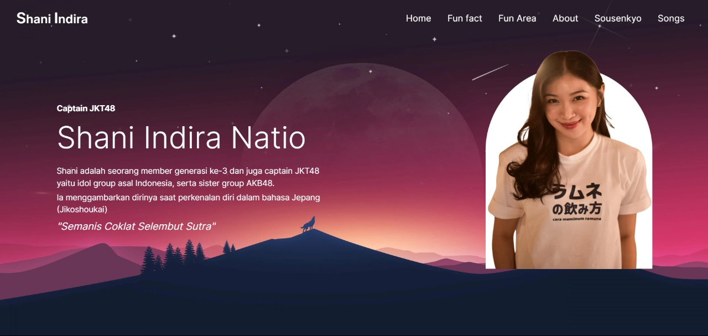

<h1 align="center" id="title">Shani Indira Website</h1>

<h2>Project Background</h2>

This Website contains about shani indira nation's journey at JKT48 including fun facts achievements and photos of Shani from Wotagrapher. The content on this website is provided for the purpose of Shani oshi and is not intended for commercial purposes.

<h2>📃Content</h2>

This Website contains about shani indira nation's journey at JKT48 including fun facts achievements and photos of Shani from Wotagrapher. The content on this website is provided for the purpose of Shani oshi and is not intended for commercial purposes.

<h2>🚀 Demo</h2>

[https://shani-indira.vercel.app/](https://shani-indira.vercel.app/)

<h2>Project Screenshots:</h2>

<h2>🧐 Features</h2>

Here're some of the project's best features:

- Full Responsive
- Random Qoutes from shani
- Quiz About Shani

<h2>💻 Built with</h2>

Technologies used in the project:

- Next JS
- Tailwindcss
- Tailwindmerge
- clsx
- Zustand
- Swiper JS
